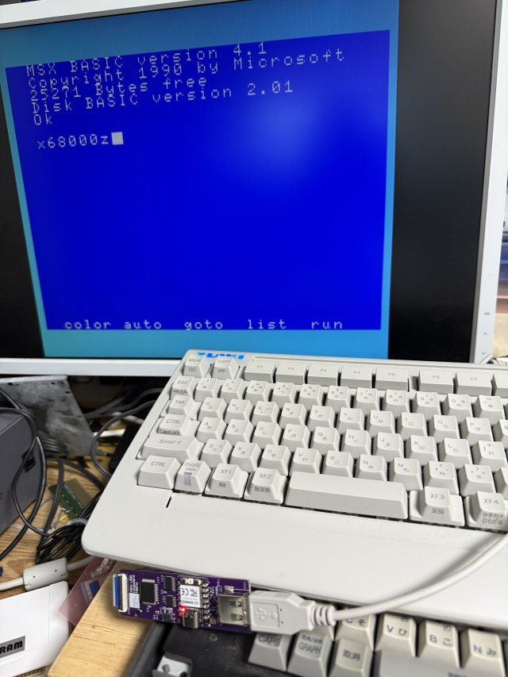

# MSX USB Keyboard Matrix MSXにUSBキーボードを外付けする改造キット
  

  

MSX USB Keyboard Mattixは、キーボード一体型のパソコンにUSBキーボードを取り付ける改造キットです。  
別売の各機種毎に用意している、取り付けサブ基板と併用することにより比較的容易な取り付けが可能になりました。  

USBのワイヤーレスタイプのキーボードとセットで使う事を想定しており、本機を経由して本体内に内蔵することで、  
本体の外見に変化無く、MSXユーザ憧れのセパレートタイプの本体へと生まれ変わらせる事が可能です。  
もちろん、従来通り本体キーボードも併用可能です。  

本アダプターでは、他類似品の様にマイコンでスキャンラインを読みとる方式はあえて使っていません。  
アナログスイッチをつかい、キーマトリクス自体を完全再現することで、ゲームなどのスキャンタイミングが異なる場合や本体のキーボード併用時の誤作動を排除しています。  

キー配置については、4つまでユーザ定義が可能で、PCに接続することで自由に設定可能です。  
また、キーボード毎(USBのPID/UID毎)にユーザ定義の自動切り替えを行うことが可能です。

## ■ 使用例
    

## ■ 頒布について   

本製品は家電のKENちゃんにて販売予定しています。  

### 家電のKENちゃん  
未定

## ■ メインモジュール機能説明

 

① CN1 USB-A端子  
キーボード接続端子です。  

② TP1 USB-Aケーブル接続端子  
コネクタは未実装です。上記USB-A端子を延長する時に使用します。  

下記の様な商品を使って端子の延長が可能になります。  
<https://www.ainex.jp/products/usb-001bc/>  
<https://www.sanwa.co.jp/product/syohin?code=TK-USB2N>  

ピン配置は以下の通りです。  
| ピン番号 | 端子名 | 説明                 | 
| -------- | ------ | -------------------- | 
| 1        | VCC    | USB +5V 電源端子です | 
| 2        | D-     | USB D- 端子          | 
| 3        | D+     | USB D+ 端子          | 
| 4        | GND    | USB GND電源端子です  | 
| 5        | Shield | USB Shield端子です(通常未使用)   | 

③ FFC30ピン端子  
サブモジュールの接続端子です。  

④ LED極性設定スイッチ  
CAPS/カナLED点灯時の信号極性通常はL側に設定します。  

⑤ BOOTスイッチ  
長押しすることで設定ファイルを初期化できます。  
また、ボタンを押しながらUSB-C端子を接続することでFirmware書き込みモードに移行します。  

⑥ リセットスイッチ  
マイコンのリセットスイッチです。  

⑦ LED  
本機の状態を示すLEDになります。  
電源が正常に投入されている時は赤色のLEDが点灯します。  
USBと正常に通信している時は青色のLEDが点滅します。  
キーボードのキー入力があると押している間緑色のLEDが点灯します。  

⑧ USB-C端子  
PCと接続することで、KEY設定の変更やFirmwareの更新を行うことが可能です。  

## ■ メインモジュールとサブモジュールについて  
本機はメインモジュールとサブモジュールの2つのモジュールで構成されます。  
メインモジュールがUSB変換を行い、サブモジュールは、機種毎の接続の違いを吸収を行っています。  
そのため、メインモジュールと本体マザーボードの接続には、機種毎に用意している専用のPCBを使います。  
機種によってはモジュールの取り付け以外に数本程度別途配線が必要なものがあります。  
また、本体が持っている機能によっては使えない機能があります。備考欄を参照の上あらかじめご了承ください。  

## ■ サブモジュール対応機種について  

下記機種の取り付けに対応しています。  
*の機種は、各種資料からの推測になり、実機での動作・取り付け未確認の機種になります。  
また、表記以外の機種についても対応している可能性があります。  
その様な機種を見つけた場合、ご連絡いただけると幸いです。  

### ■Panasonic
### ●サブユニット FS-A1   
備考：Resetキー機能には、非対応  

    対象機種：[MSX2] FS-A1  
取り付け方法  
<https://github.com/v9938/USBKeyboardMatrix/tree/main/setting/PANASONIC/setting_FS-A1.md>

### ●サブユニット FS-A1mk2  
備考：Resetキー機能には、非対応  

    対象機種：[MSX2] FS-A1mk2  
取り付け方法  
<https://github.com/v9938/USBKeyboardMatrix/tree/main/setting/PANASONIC/setting_FS-A1mk2.md>

### ●サブユニット FS-A1F  
備考：PAUSEキー非対応（原因調査中）

    対象機種：[MSX2] FS-A1F  
    (FS-A1FMは、配置は同じだがコネクタピッチが異なるため対応不可)
取り付け方法  
<https://github.com/v9938/USBKeyboardMatrix/tree/main/setting/PANASONIC/setting_FS-A1F.md>

### ●サブユニット FS-A1FX/WX/WSX/ST/G  

    対象機種：[MSX2+]  FS-A1FX*/FS-A1WX/FS-A1WSX  
             [MSX TR] FS-A1ST/FS-A1GT

取り付け方法(FX/WX/WSX)  
<https://github.com/v9938/USBKeyboardMatrix/tree/main/setting/PANASONIC/setting_FS-A1wsx.md>

取り付け方法(ST/GT)  
<https://github.com/v9938/USBKeyboardMatrix/tree/main/setting/PANASONIC/setting_FS-A1gt.md>

### ■SONY
### ●サブユニット SONY HB101/HB202   
備考：カソード側にLEDの電流制限抵抗がついているため、CAPS/カナLEDの点灯検知が上手く行かない機種があります。  

    対象機種：[MSX]  HB-10*/HB-55*/101*/202
             [MSX2] HB-F1*/HB-F1mk2*  
取り付け方法  
<https://github.com/v9938/USBKeyboardMatrix/tree/main/setting/SONY/setting_HB202.md>

### ●サブユニット SONY HB－F1XD/XDmkII/XDJ/XV   

    対象機種：[MSX2]  HB-F1XD*/HB-F1XDmk2　　
    　　　　　[MSX2+] HB-F1XDJ/HB-F1XV 
取り付け方法
<https://github.com/v9938/USBKeyboardMatrix/tree/main/setting/SONY/setting_HB-F1XV.md>

### ■SANYO 
### ●サブユニット WAVY70FD/70FD2   

    対象機種：[MSX2]  PHC-23J*/PHC-77*　　
    　　　　　[MSX2+] PHC-35J*/PHC-70FD/PHC-70FD2 
取り付け方法  
<https://github.com/v9938/USBKeyboardMatrix/tree/main/setting/SANYO/setting_WAVY70.md>

## ■ サブモジュール非対応機種について  
キーセパレートタイプ以外のMSXであれば大抵対応可能だと思います。実機入手が問題があり、個人での対応は限界があります。  
下記の様なFFCケーブルのブレイクアウトボードを使い、キーマトリクスに直接配線を半田付けすることも検討ください。  

 

愚痴：  
見た目は同じなのに機種毎に微妙にキーボードコネクタ位置が変わるパナソニックや同じコネクタで全く配置が異なるカシオのエンジニアには、なぜそうなったと聞きたい・・・  

## ■ ブレイクアウトボードについて  
ブレイクアウト上の端子配置は以下の通りになっています。  
※初出時にGNDと＋5Vの位置を逆にしていました。申し訳ありません  

| ピン番号 | 信号名    |             |                                                           | 
| -------- | --------- | ----------- | --------------------------------------------------------- | 
| 1,2,3    | GND       | Input       | GND                                                       | 
| 4,5,6    | +5V IN    | Input       | +5V 入力                                                  | 
| 7        | RESET KEY | Output      | Resetキー出力、当該キーが押されるとGNDレベルになります。  | 
| 8        | CAPS LED  | Input       | CAPS LED入力、極性はボード上のスイッチで設定可能です。    | 
| 9        | KANA LED  | Input       | KANA LED入力、極性はボード上のスイッチで設定可能です。    | 
| 10       | X7        | Bidirection | キーマトリクス X7                                         | 
| 11       | X6        | Bidirection | キーマトリクス X6                                         | 
| 12       | X5        | Bidirection | キーマトリクス X5                                         | 
| 13       | X4        | Bidirection | キーマトリクス X4                                         | 
| 14       | X3        | Bidirection | キーマトリクス X3                                         | 
| 15       | X2        | Bidirection | キーマトリクス X2                                         | 
| 16       | X1        | Bidirection | キーマトリクス X1                                         | 
| 17       | X0        | Bidirection | キーマトリクス X0                                         | 
| 18       | PAUSE KEY | Output      | Pauseキー出力、当該キーが押されるとGNDレベルになります。  | 
| 19       | Y11       | Bidirection | キーマトリクス Y11                                        | 
| 20       | Y10       | Bidirection | キーマトリクス Y10                                        | 
| 21       | Y9        | Bidirection | キーマトリクス Y9                                         | 
| 22       | Y8        | Bidirection | キーマトリクス Y8                                         | 
| 23       | Y7        | Bidirection | キーマトリクス Y7                                         | 
| 24       | Y6        | Bidirection | キーマトリクス Y6                                         | 
| 25       | Y5        | Bidirection | キーマトリクス Y5                                         | 
| 26       | Y4        | Bidirection | キーマトリクス Y4                                         | 
| 27       | Y3        | Bidirection | キーマトリクス Y3                                         | 
| 28       | Y2        | Bidirection | キーマトリクス Y2                                         | 
| 29       | Y1        | Bidirection | キーマトリクス Y1                                         | 
| 30       | Y0        | Bidirection | キーマトリクス Y0                                         | 

## ■ キー配置について  

キーボードのキー配置配置は、4つまで持つことができます。  
キー配置は、下記のキーを5秒以上継続して押し続けることで設定ファイルを切り替えることが出来ます。  

| 同時押しキー               | 使用される設定ファイル | Default 設定値                                | 
| -------------------------- | ---------------------- | --------------------------------------------- | 
| [SHIFT]+[CTRL]+[ALT] + [q] | KEYMAP0.JSN            | 日本語108キーボード向け設定                   | 
| [SHIFT]+[CTRL]+[ALT] + [w] | KEYMAP1.JSN            | 日本語108キーボード向け設定 [CAPS↔CTRL Swap] | 
| [SHIFT]+[CTRL]+[ALT] + [e] | KEYMAP2.JSN            | 英語101キーボード向け設定                     | 
| [SHIFT]+[CTRL]+[ALT] + [r] | KEYMAP3.JSN            | ユーザ設定用                                  | 

キー配置の設定が成功すると、BASIC画面にKEYMAPx.JSN Selctedという文字がTypeされます。  

キー配置の設定ファイルは使用するキーボード毎に保存されます。(※128台以内)  
なお、初めて接続するキーボードは必ずKEYMAP0.JSNが選択されます  

## ■ キー設定ファイルについて  
Xiao RP2040側のUSB-CコネクタをPCに接続すると、上記配置設定を行うファイルが表示されます。  
 

当該ファイルはJSON形式でかかれており、設定値を書き換えることでキーの配置を変更することが可能です。  
なお設定値は、内部処理の都合により即時に反映されません、次回の起動時に反映されます。  
ファイル容量についても、内部バッファーの関係で32K以内で納める様にお願いします。  

各要素値の意味は下記の通りです。  
 

| ルート名 | 説明                                                                  | 
| -------- | --------------------------------------------------------------------- | 
| Modifier | SHIFT/ALT/Ctrl/Menuキーのキー配置のマトリクス設定値が書かれています。 | 
| Usage    | 上記以外のキー配置のマトリクス設定値が書かれています。                | 
| ASCII    | 本機からASCII文字を出力する時に使われるマトリクス設定値になります。   | 

| 要素名 | 説明                                                                                                                                                                                                            | 
| ------ | --------------------------------------------------------------------------------------------------------------------------------------------------------------------------------------------------------------- | 
| Id     | USBのキーIDコード(HEX)                                                                                                                                                                                          | 
| Y      | 0=キー割り当て無し  MatrixのY方向1-16   1= Y0マトリクス 2= Y1マトリクス ... 16=Y15マトリクス  または 17=PAUSEキー 18=RESETキー  (一つのIDに対して2つまで持つことができます) | 
| Mask   | MatrixのX方向のマスク値 当該BITを1にしたところがONになります。  (一つのIDに対して2つまで持つことができます)                                                                                            | 
| Name   | キー名 (本体内部では未使用です)                                                                                                                                                                              | 

## ■設定の初期化方法について  
Xiao RP2040ボード上の[B]スイッチを5秒以上押し続けると、ボード上の赤LEDが点灯し、上記キー設定ファイルが初期状態になります。  

## ■ 他機種への流用について  

また、MSX用としているもののその仕組み上、他機種でも使える可能が高いです。  
興味がある方は、問い合わせいただければ幸いです。  

## ■ ファームウェアアップデートについて
ボード上の[B]スイッチを押しながら、Xiao RP2040のUSB端子にPCを接続してください。  
下記の様にファイルが見えますので、ここにファームウェアをコピーすると完了です。  

## 謝辞：  
本製品には下記ソフトウェアおよび成果物を使用しています。 

### Raspberry Pi Pico SDK  
<https://github.com/raspberrypi/pico-sdk>
### PIO-USB
<https://github.com/sekigon-gonnoc/Pico-PIO-USB>
### USBStack TinyUSB  
<https://docs.tinyusb.org/en/latest/>  
### cJSON
<https://github.com/DaveGamble/cJSON>  
### littlefs
<https://github.com/littlefs-project/littlefs>

## ■ GitHub公開データについて

ファームウェア：　　 <https://github.com/v9938/USBKeyboardMatrix/tree/main/firmware>  
回路図/基板データ：　<https://github.com/v9938/USBKeyboardMatrix/tree/main/PCB>  
サブユニット：　<https://github.com/v9938/USBKeyboardMatrix/tree/main/PCB/GarberFile/JIGU_PCB>

## ■ 本機の仕様について

|仕様  | 詳細 |
| - | - |
| 使用マイコン |  Raspberry Pi RP2040 (Seeed XIAO RP2040に搭載) |
| 定格 | 5V 30mA + USBキーボードの消費電流|
| 対応キーボード | USB HID(V1.1)規格キーボード準拠 |
| ポーリング間隔 | 1ms(実測値) |  
| 入力 | トレラント入力 LED入力 x2 |  
| 出力1 | アナログスイッチ方式　キーマトリクス出力 8x16 |  
| 出力2 | アナログスイッチ方式　Lowアクティブ出力 x2 |  

## ■ 動作確認済みキーボード  
### ロジクール 
Unifyingレシーバ U-U0007,U-U0008,U-U0012 / LOGIBOLTレシーバ CU0021    
ワイヤーレスキーボード K270,PEBBLE KEY K380S,K400,POP Keys (事前にPCで対応レシーバとペアリングしておくこと)  
メカニカルキーボード G413 SE  
### HP
HP Keyboard KU-1469  
HP Wireless Keyboard HSA-A005K (US KEYBOAD)  
### Lenovo
KEYBOARD KU-1255  
KEYBOARD KU-1619 (US KEYBOAD)  
### トープレ
Realforce / R2-JP3-BK
Realforce 108P-S
### サンワサプライ
SKB-WL32BK (CAPS LEDがキーボードで管理しており、本体の状態と一致しない場合があります)  
SKB-SL10BK
### ELECOM
TK-FDM063 (CAPS LED/NUM LOCK LEDの状態反映が遅いです。しばらくすると消灯します)  
### ZUIKI  
X68000Z KEYBOARD ZKXZ-003 (要：EAK対策)
### SAMMY(ASCII)  
キーパッド ミニ　　

