# Panasonic FS-A1用サブユニット取り付け方法  

## 取り付け後イメージ
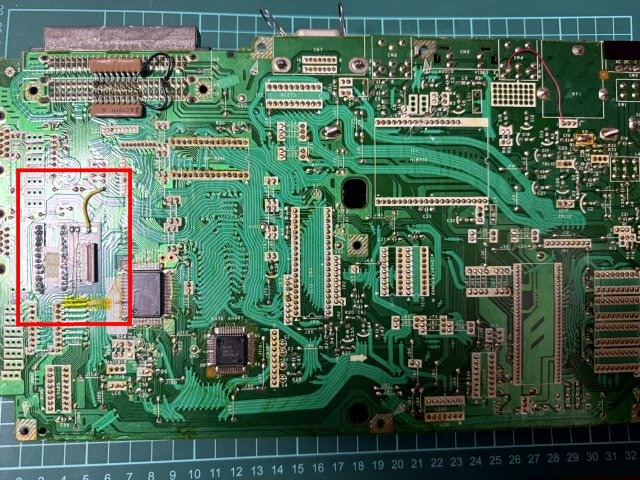

### キーボード端子
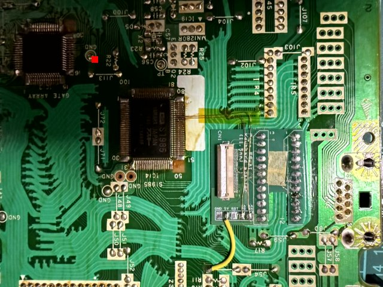

### その他配線箇所
KANA LED/CAPS LEDは、S1985から引き出す必要があり難易度が高いので非推奨です。  
GNDは、未配線で問題ありません。  
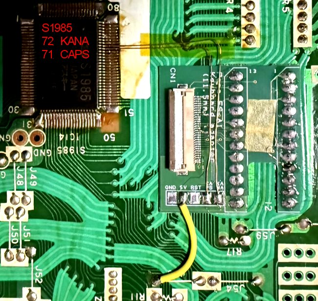

### メインユニット固定位置
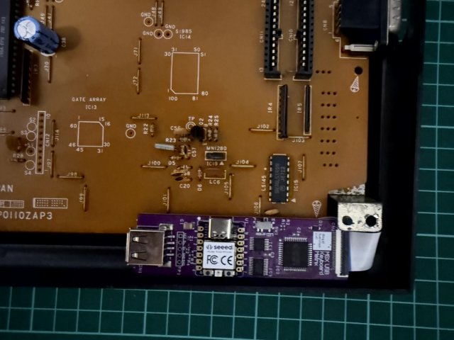

## 本機種における制限事項について  
RESETキーは、適切な接続先がないため使用できません。    

## 取り付け方法  

1. マザーボードの裏面にアクセス出来るまで、本体を分解する。  
2. キーボードコネクタの裏面、サブユニット取り付けの下に必要に応じて付属シールなどを張って絶縁する。  
（基本的には基板が傷つかない限りは大丈夫ですが念のため）  
3. サブユニットを半田付けします。  
4. その他配線（電源,CAPS LED,KANA LED,PAUSEキー,RESETキーなど)を結線します。  
5. メインユニットとサブユニットをFFCケーブルを接続します。  
シールドケースに挟み込む場合は、当該箇所を絶縁テープなどで保護してください。
6. メインユニットを付属の両面テープなどで固定します。  
7. ワイヤレスタイプのキーボードを接続する場合はレシーバを取り付けます。  
8. 動作確認して問題無ければ、本体を組み立て直します。

## メインユニットの取り付け位置について  
ワイヤレスタイプのUSBレシーバを使用する場合、シールドケースに覆われる位置に取り付けると距離が短くなるモノがあります。  
レシーバがシールドから極力離した位置になるように取り付けてください。  

## FFCケーブルの取り付けについて

    重要：0.5mmピッチと細かく、斜めの状態で接続してしまうと、端子がショートする可能性が高いです。
         青色の部分とコネクタが平行になっているか十分確認しつつ、取り付けをお願いします。
         

### FFCケーブルのコネクタへの固定手順  

1.  ロックレバーを上方向に押し上げます。ロックレバーは、親指や人差し指の爪により、跳ね上げる感じで押し上げます。  
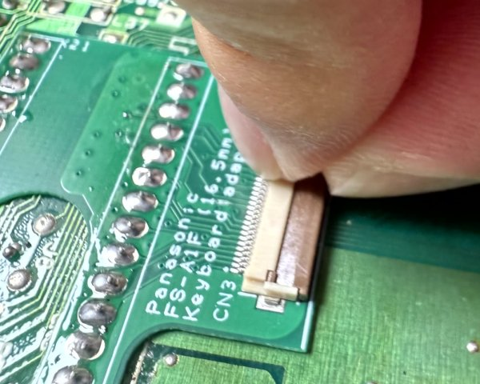
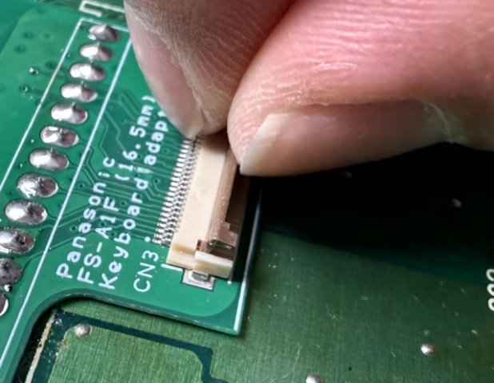  
ロックレバーは90度程度までしか開きません。それ以上開くと壊れる場合があるので注意してください。  
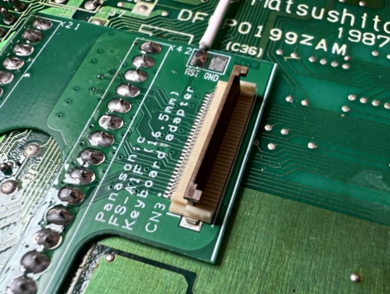

2.  FFCケーブルを接点面を下にして挿入します。（青色のシールが上）  
その際FFCはコネクタに対して青色のシールのエッジが平行になるように奥まで挿入してください。
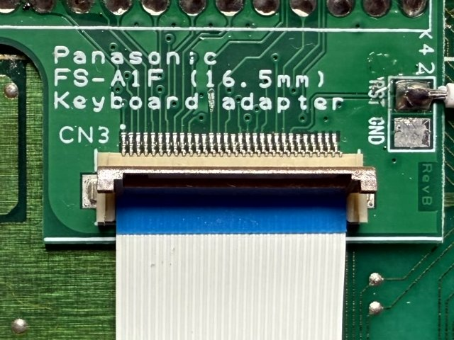  

3. ロックレバーを閉じる様に押し下げてロックしてください。  
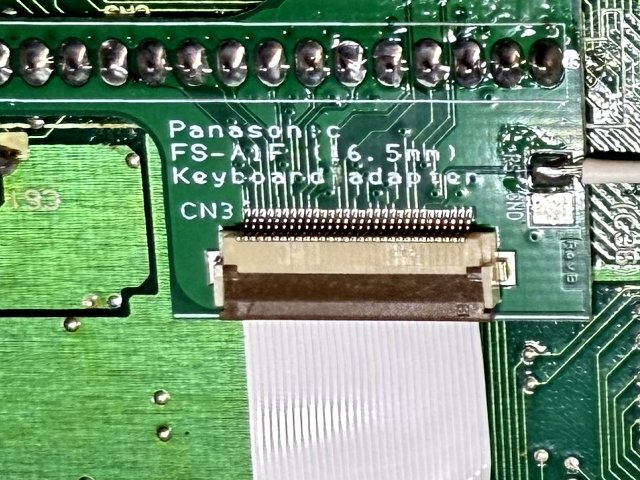  
ケーブルが半挿入、挿入ずれ、斜め差しの場合ロックレバーの掛かりが悪く浮き上がります。  
その場合はケーブルを一度抜去してから再度挿入してください。無理にロックを行うとコネクタが破損します。  

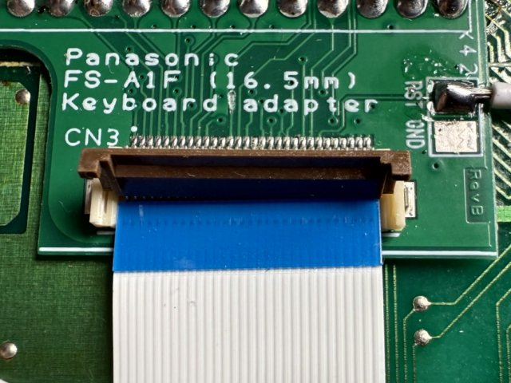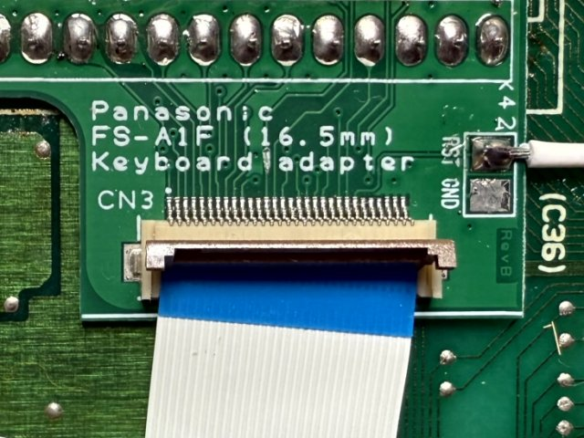

### FFCケーブルのコネクタへの取り外し方法  
基本的に取り付け時の逆手順になります。

1. ロックレバーを上方向に押し上げロックを解除します。  
2. ロック解除後、ケーブルを抜き取ります。  
3. ロックレバーを押し下げ元に戻します。  

### FFCコネクタ取り扱いについて (参考資料)  
ヒロセ電機 FH12シリーズカタログ P21～を参照

https://www.hirose.com/ja/product/document?clcode=&productname=&series=FH12&documenttype=Catalog&lang=ja&documentid=D31648_ja